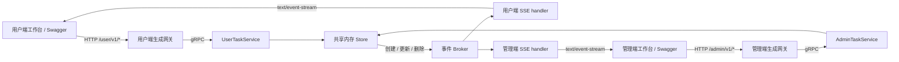
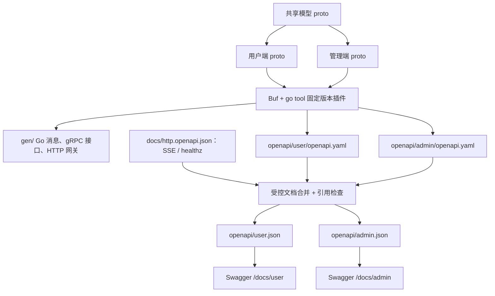
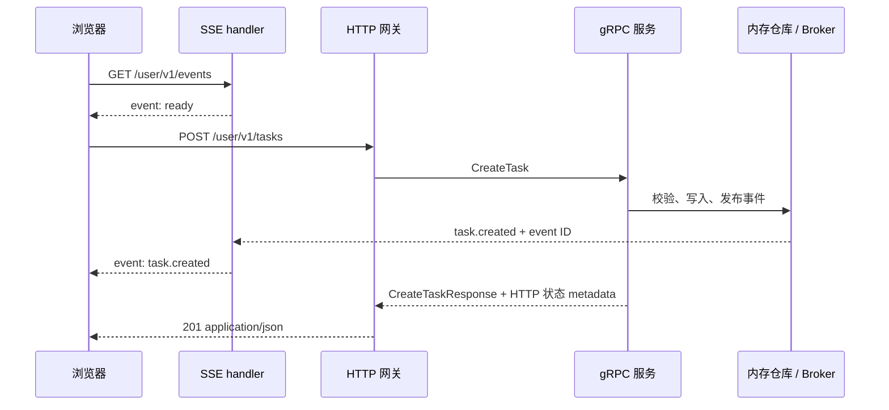

# Proto API Lab：user / admin 双端 API 最小示例

这个示例保留 **proto 作为 CRUD 接口定义**，使用 **Go + Buf + gRPC-Gateway + OpenAPI 3.0.3 + Swagger UI**。用户端和管理端分别拥有 proto、HTTP 路由、网关注册和文档；两端共享一个内存任务仓库，方便观察 CRUD 与 SSE 的联动。

## 1. 快速启动

```bash
cd ~/code/www/api-toolchain-demo
mise install
mise run setup
mise run dev
```

首次安装会下载固定版本的 Go、Buf 和 Go 工具依赖。启动后访问：

| 入口 | 地址 |
| --- | --- |
| 用户端 CRUD / SSE 工作台 | http://127.0.0.1:8088/ |
| 管理端 CRUD / SSE 工作台 | http://127.0.0.1:8088/?role=admin |
| 用户端 Swagger | http://127.0.0.1:8088/docs/user |
| 管理端 Swagger | http://127.0.0.1:8088/docs/admin |
| 用户端 OpenAPI 3 | http://127.0.0.1:8088/openapi/user.json |
| 管理端 OpenAPI 3 | http://127.0.0.1:8088/openapi/admin.json |
| 健康检查 | http://127.0.0.1:8088/healthz |
| gRPC，含 reflection | `127.0.0.1:9091` |

`mise run dev` 使用 Air：修改 proto、Go 或页面后，会重新生成、编译和重启。只启动一次可运行 `mise run run`。修改端口：

```bash
HTTP_ADDR=127.0.0.1:8089 GRPC_ADDR=127.0.0.1:9092 mise run dev
```

这个演示不需要数据库、Redis、Node.js 或单独的 protoc 安装。任务和事件历史保存在内存中，**每次重启都会清空**。user/admin 在这里是接口分组，尚未实现登录、身份认证和数据权限隔离。

## 2. 工具链及选择原因

| 工具 | 固定版本 | 职责 |
| --- | --- | --- |
| Go | 1.27.1 | 服务运行和编译；`go tool` 执行项目工具 |
| Buf | 1.73.0 | 编译 proto、管理依赖、lint 和生成配置 |
| protoc-gen-go | 1.36.12 | 生成 Go 消息类型 |
| protoc-gen-go-grpc | 1.6.2 | 生成 gRPC 服务接口和客户端 |
| gRPC-Gateway | 2.30.0 | 生成 HTTP JSON → gRPC 的网关 |
| gRPC Go | 1.83.2 | 运行 gRPC 服务 |
| Google gnostic / protoc-gen-openapi | 0.7.1 | 直接从 proto 生成 OpenAPI 3.0.3 |
| Swagger UI | 5.32.15 | 展示 OpenAPI 3 并发送调试请求 |
| Air | 1.67.4 | 本地开发自动生成、编译和重启 |

这是常见的 proto-first 组合。网关与文档生成器分别负责协议转换和接口描述，**使用 gRPC-Gateway 并不要求输出 Swagger 2.0**。本例直接使用稳定的 gnostic OpenAPI 3 生成器；没有做 OpenAPI 2 → 3 的中间转换。

版本有明确归属：

- `mise.toml` 固定 Go、Buf，并提供统一命令。
- `go.mod` 的 `tool` 指令和 `go.sum` 固定 Go 生成器、Air 及依赖；`buf.gen*.yaml` 使用 `go tool` 调用它们。
- `buf.lock` 固定 Google API 注解和 gnostic 注解的 BSR 提交及摘要。
- `web/vendor/` 保存固定版本的 Swagger UI 静态资源、许可证及 SHA-256；浏览文档时不依赖 CDN。文档页使用官方默认的 Standalone 布局、样式和图标，顶部通过原生文档下拉框切换 user / admin；直接访问 `/docs/user` 或 `/docs/admin` 会默认选中对应文档。

参考：[Buf](https://buf.build/docs/generate)、[gRPC-Gateway](https://github.com/grpc-ecosystem/grpc-gateway)、[gnostic OpenAPI 插件](https://github.com/google/gnostic/tree/main/cmd/protoc-gen-openapi)、[Swagger UI](https://github.com/swagger-api/swagger-ui)。

## 3. 架构

### 运行时



HTTP 与 gRPC 在同一 Go 进程内运行，但 HTTP CRUD 确实经由 gRPC-Gateway 调用本地 gRPC 服务。浏览器不需要理解 gRPC。

### 生成与文档链路



`google.api.http` 决定路由、HTTP 方法和请求体；gnostic 注解决定文档标题、字段约束和成功状态。两个端分别调用文档生成器，避免输出文件相互覆盖。Swagger UI 只读取对应端的 OpenAPI 3 JSON，不直接解析 proto。

### 一次修改如何变成实时事件



事件可能早于创建请求的 HTTP 响应到达；页面通过重新查询列表同步状态。这里的 SSE 是原生 HTTP 实现，gRPC-Gateway 默认的 JSON 分块流不能直接替代 EventSource 所需的 SSE 分帧。

## 4. 接口

以下 CRUD 在两端各有一份。将 `{side}` 替换为 `user` 或 `admin`：

| 方法 | 路径 | 行为 |
| --- | --- | --- |
| POST | `/{side}/v1/tasks` | 创建任务，成功返回 201 |
| GET | `/{side}/v1/tasks` | 列表，支持 `completed`、`limit`、`offset` |
| GET | `/{side}/v1/tasks/{id}` | 详情；不存在返回 404 |
| PATCH | `/{side}/v1/tasks/{id}` | 部分更新标题、描述、完成状态 |
| DELETE | `/{side}/v1/tasks/{id}` | 删除任务，返回删除结果 |
| GET | `/{side}/v1/events` | SSE 订阅 |
| GET | `/admin/v1/stats` | 仅管理端：总数、完成数、订阅数、最新事件 ID |
| GET | `/healthz` | 进程健康检查，两份文档均可见 |

响应直接使用 proto 中定义的结构，例如 `{"task": {...}}`、`{"tasks": [...], "total": 1}`；没有服务端额外添加但文档缺失的统一包裹层。错误沿用 gRPC-Gateway 的 `code/message/details` 格式。

`PATCH` 使用 proto3 `optional`：省略字段表示不修改，`completed: false` 表示明确改为未完成，`description: ""` 表示清空描述。标题去空白后必须为 1～120 个字符，描述最多 1000 个字符；这些限制由两端共用业务层执行。

## 5. 实际调用

在第一个终端订阅：

```bash
curl -N http://127.0.0.1:8088/user/v1/events
```

另一个终端创建任务：

```bash
curl -i -X POST http://127.0.0.1:8088/user/v1/tasks \
  -H 'Content-Type: application/json' \
  -d '{"title":"体验 OpenAPI 3","description":"由 proto 生成 HTTP 接口"}'
```

用响应里的 ID 替换下面的 `task-000001`：

```bash
curl http://127.0.0.1:8088/user/v1/tasks/task-000001

curl -X PATCH http://127.0.0.1:8088/admin/v1/tasks/task-000001 \
  -H 'Content-Type: application/json' -d '{"completed":true}'

curl 'http://127.0.0.1:8088/user/v1/tasks?completed=true&limit=10'

curl http://127.0.0.1:8088/admin/v1/stats

curl -X DELETE http://127.0.0.1:8088/admin/v1/tasks/task-000001
```

浏览器订阅方式：

```js
const stream = new EventSource('/user/v1/events');
stream.addEventListener('task.created', event => {
  console.log(event.lastEventId, JSON.parse(event.data));
});
stream.addEventListener('reset', () => {
  // 历史已过期，重新 GET /user/v1/tasks。
});
// 页面卸载或用户关闭实时功能时：stream.close();
```

## 6. SSE 行为

- `ready`：连接建立，包含最新事件 ID 和重放数量。
- `task.created` / `task.updated` / `task.deleted`：负载类型是共享 proto 中的 `TaskEvent`，包含 `eventId/type/task/occurredAt`。
- 心跳：每 10 秒一条 SSE 注释，不触发浏览器业务事件。
- 自动重连：服务发送 `retry: 1000`。浏览器恢复同一个 EventSource 连接时自动带 `Last-Event-ID`。
- 显式重放：`curl -N -H 'Last-Event-ID: 1' URL`，或首次连接使用 `?last_event_id=1`。
- 历史范围：内存保留最近 128 条；游标过期或超出当前序列时发出 `reset`，客户端重新查询列表。
- 读客户端断开时注销订阅。单个订阅最多缓冲 32 条事件，慢客户端会被断开并通过重连重放恢复，不阻塞任务写入。

OpenAPI 3 用 `text/event-stream` 描述流响应，用 `x-sse-events` 补充单帧类型。`TaskEvent` 是单帧的 data，不是整个 HTTP 响应体。Swagger 的 Try it out 会等待持续流结束，体验 SSE 请使用首页、EventSource 或 `curl -N`。

## 7. 日常修改与检查

```bash
# 只生成；不会启动服务。
mise run generate

# 检查 proto、生成前后逐字节一致，以及 Go 编译。
mise run check

# 先启动服务，再运行 HTTP / SSE 冒烟验证。
mise run smoke
```

`checkgen` 在生成前后计算 `gen/` 和 `openapi/` 的内容摘要，即使这个目录尚未初始化 Git 也能检查产物是否同步。建议把 proto、生成文件、所有版本配置一起提交；CI 执行相同检查。

需要升级 proto 依赖时，显式执行 `buf dep update` 并评审 `buf.lock`。普通开发和启动不会自动升级依赖。Go 生成器通过 `go get -tool 包路径@明确版本` 升级；不要改为 `@latest` 后让每台机器各自解析。

## 8. 文件结构

```text
api/demo/model/v1/         共享 Task / TaskEvent
api/demo/user/v1/          用户端 RPC、HTTP 映射和文档注解
api/demo/admin/v1/         管理端 RPC、HTTP 映射和文档注解
gen/                      生成的 Go 消息、gRPC 接口和 HTTP 网关
internal/tasks/service.go 共用任务业务层
internal/tasks/user.go    用户端 gRPC 适配
internal/tasks/admin.go   管理端 gRPC 适配
internal/tasks/events.go  SSE Broker、重放和 HTTP handler
cmd/server/               双端注册、Swagger 页面、优雅退出
cmd/openapi/              合并 SSE 文档，检查引用，生成两份 JSON
cmd/checkgen/             生成可复现性检查
cmd/smoke/                HTTP / SSE 冒烟检查
docs/http.openapi.json    非 proto HTTP 路由及 SSE 文档片段
openapi/user/             用户端原始生成 YAML
openapi/admin/            管理端原始生成 YAML
openapi/user.json         用户端发布文档
openapi/admin.json        管理端发布文档
web/                      双端工作台、Swagger 页面和固定版本资源
buf.yaml / buf.lock       proto 模块、检查规则和依赖锁
buf.gen*.yaml             Go 生成和两端文档生成配置
mise.toml / .air.toml      工具版本、任务入口和开发热更新
go.mod / go.sum           运行依赖和 Go 工具依赖
```

此示例重点是可复现的生成链路、双端文档和真实 SSE。内存仓库没有持久化，事件重放不跨重启，鉴权与多实例消息广播未实现；引入这些能力时，应在共用业务层和事件层扩展，而不是手改生成代码。
